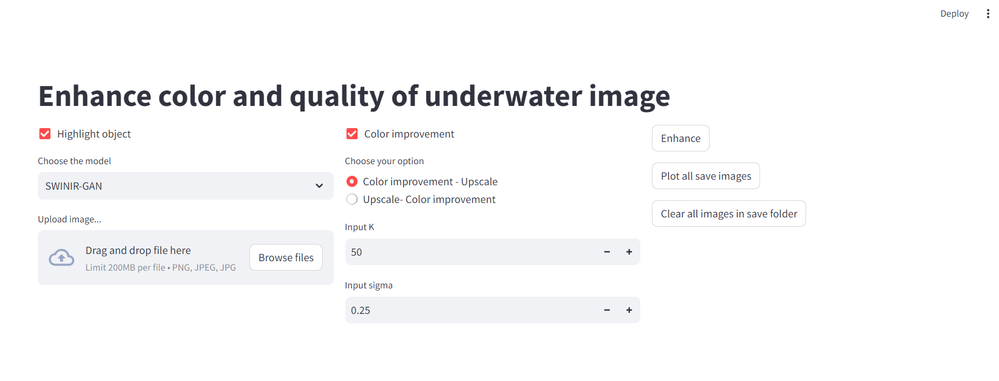
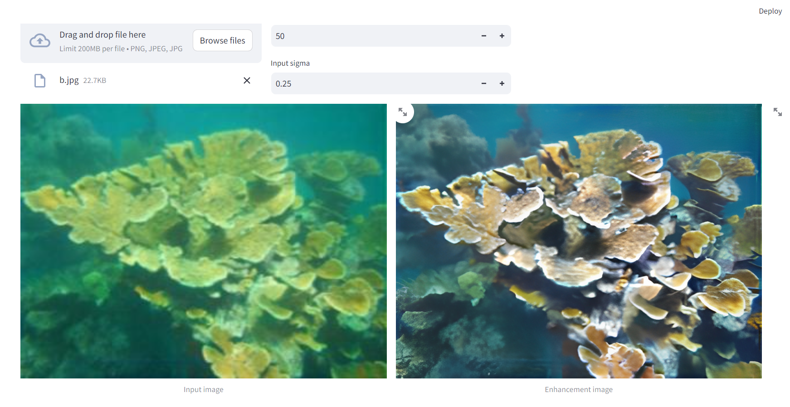

# AI Capstone Project: Enhance the Quality and Color of Underwater Images
# Members
* Advisor: Nguyen Quoc Trung
* Dinh Hoang Lam
* Tran Duy Ngoc Bao

Our report: [Final_report](https://drive.google.com/file/d/1qMNfoY5egNpE_tzV5rnuMPKIlUMHbxV8/view?usp=drive_link) | [Slide](https://drive.google.com/file/d/1emGnUvs8X08uOkv-slvseulVkSBRDP_H/view?usp=sharing)
 
<!-- # Dataset
```
comming soon
```

# Training
```
comming soon
```
The training code of our thesis is similar to authors of SWINIR, BSRGAN and ESRT -->

# Run demo
1. Download SWINIR-GAN and BSRGAN weights: [weights](https://drive.google.com/drive/folders/1jmL5SE8rQRSRA6ac3U84OOkEIKYy_WGk?usp=sharing)
2. Then move weights to `AI-THESIS/demo/weights`
    
    ```
    cd AI-THESIS/demo
    streamlit run demo.py
    ```
3. UI demo

<div align="center">
    
</div>

<div align="center">
    
</div>

# References
1. BSRGAN: [cszn/BSRGAN](https://github.com/cszn/BSRGAN) | [cszn/KAIR](https://github.com/cszn/KAIR)
1. SWINIR: [JingyunLiang/SwinIR](https://github.com/JingyunLiang/SwinIR) | [cszn/KAIR](https://github.com/cszn/KAIR)
1. White balance: [mahmoudnafifi/WB_sRGB](https://github.com/mahmoudnafifi/WB_sRGB.git)